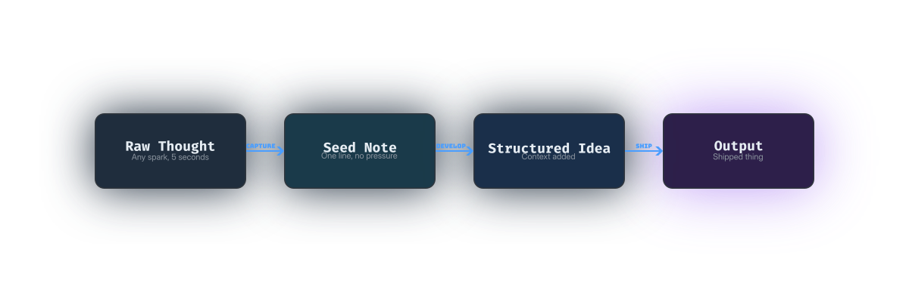

<div align="center">



<h1>🧠 Low Attention Span Toolkit</h1>

<p>A tiny, finishable toolkit for people who think fast, get overwhelmed easily, and want to actually <em>ship things.</em></p>

[](./LICENSE)
[](https://github.com/deepagency/low-attention-span-toolkit/pulls)
[](https://github.com/deepagency/low-attention-span-toolkit)
[](https://github.com/deepagency/low-attention-span-toolkit/graphs/commit-activity)

<br/>

[Get Started](#-2-minute-setup) · [View Templates](#-whats-inside) · [Contribute](#-contributing) · [Philosophy](#-why-tiny-projects-win)

</div>

---

## ⚡ 2-Minute Setup

> New here? Do exactly two things, in this order.

**1.** [Steal the Daily Note Template →](./daily-note-template.md)

**2.** [Learn the 5-Second Capture Method →](./low-attention-capture-system.md)

You're set up. Close this tab. Go use it.

---

## 📦 What's Inside

| File | Purpose | Time to Read |
|---|---|---|
| [📅 daily-note-template.md](./daily-note-template.md) | Your daily thinking engine | 1 min |
| [⚡ low-attention-capture-system.md](./low-attention-capture-system.md) | 5 / 10 / 30-second capture methods | 2 min |
| [🚀 micro-post-generator.md](./micro-post-generator.md) | Turn raw thoughts into posts | 2 min |
| [🌱 tiny-projects-philosophy.md](./tiny-projects-philosophy.md) | Why small beats big, every time | 3 min |

---

## 🗺️ The Core Pipeline

Every tool in this repo maps to one stage:

```
💡 Raw Thought  ──▶  🌱 Seed Note  ──▶  📖 Structured Idea  ──▶  🚀 Output
   (5 seconds)         (1 sentence)         (context added)         (shipped)
```

**Capture first. Organize later. Ship always.**

---

## 🚫 What This Is Not

This is not a complex productivity system.
This is not a GTD clone.
This is not a course you'll never finish.

> It's a tiny toolkit that helps you think better and finish things.

---

## 💡 Why Tiny Projects Win

Most creators follow this loop:

```
Big idea → Excitement → Planning → More planning → Overwhelm → Abandon
```

The fix isn't more discipline. It's **smaller scope.**

- ✅ Tiny projects get **finished**
- ✅ Finished things build **momentum**
- ✅ Momentum creates **consistency**
- ✅ Consistency compounds into a **body of work**

[Read the full philosophy →](./tiny-projects-philosophy.md)

---

## 🤝 Contributing

Contributions are what make open source great. If you've adapted any of these templates for your own workflow, consider sharing it.

1. Fork the repo
2. Add your template to a `community/` folder
3. Open a PR with a one-line description of what it does

**Keep it tiny.** If your addition can't be described in one sentence, it's probably too big.

---

## 📄 License

Distributed under the MIT License. See [`LICENSE`](./LICENSE) for more information.

Free to use, steal, remix, and ship.

---

<div align="center">

Built by a low-attention-span dev, for low-attention-span creators.

**[⭐ Star this repo](https://github.com/deepagency/low-attention-span-toolkit)** if it helped you ship something tiny.

</div>
